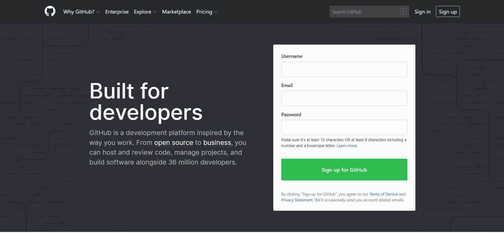
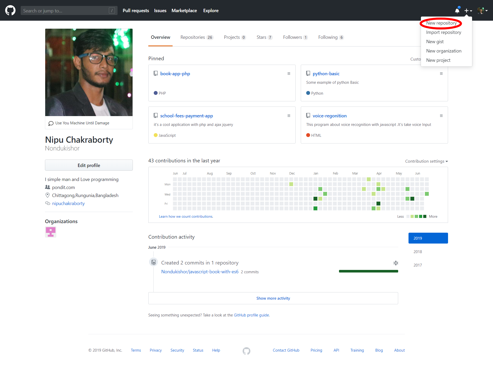
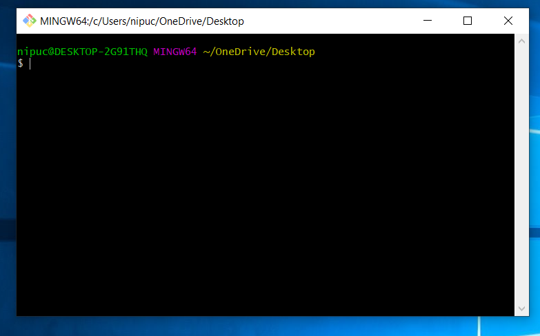
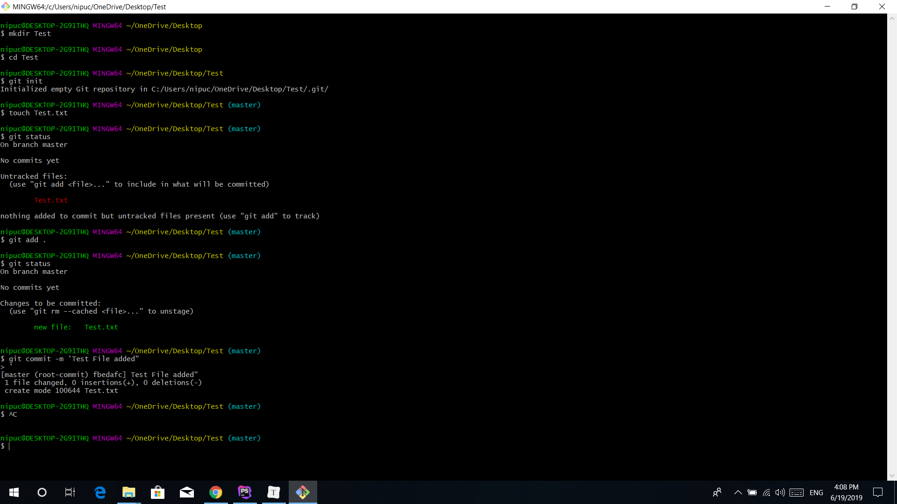
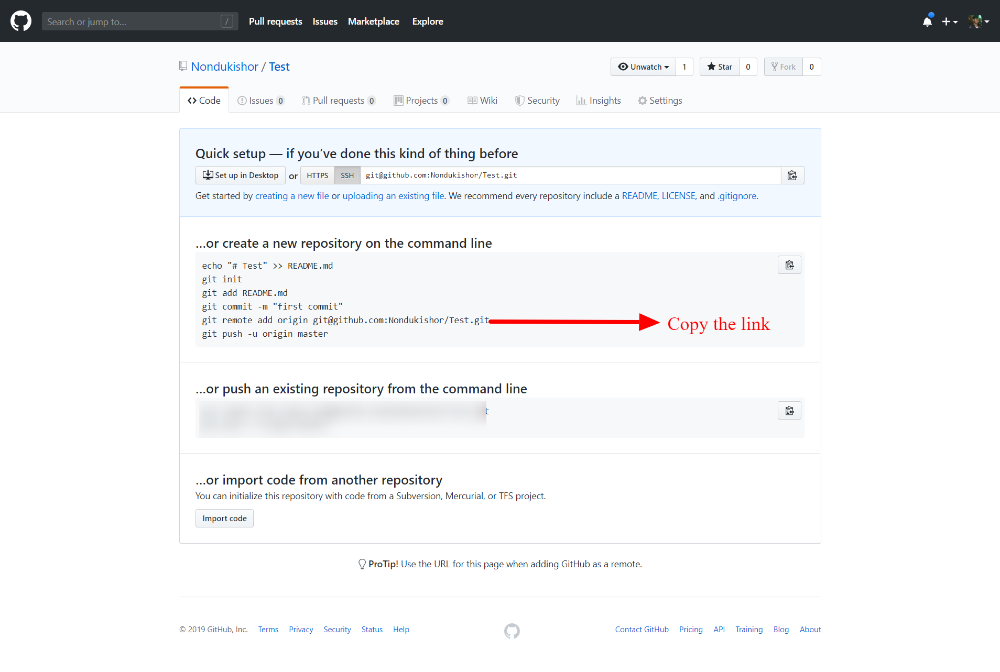

<center>গিট টিটোরিয়ার</center>
আজকের জন্য থাকছে অত্যন্ত গুরুত্বপূর্ণ  টপিক নিয়ে আলোচনা। আমারা যারা প্রোগ্রামিং করি তাদের জন্য গিট হচ্ছে একটি এমন মাধ্যম যার মাধ্যমে কজের ১০০% সিকিউরিটি থাকে। রিমোটলি প্রজেক্ট ম্যানেজ করা যায় । সবকিছু মিলিয়ে গিট হচ্ছে প্রোগামারদের লাইফ সেবিংস মেডিসিন। তাই আর আজে বাজে না বকে শুরু করে দেই গিট নিয়ে আলোচনা । তো প্রথমেই এই লিঙ্কে গিয়ে একাউন্ট খুলে নেই <a href="https://github.com/">Click</a>




লিঙ্কে গেলেই আপনি টিক এইরকমের একটি পেইজ পাবেন আর এইখানে আপানার নাম ই-মেইল আর পাসয়ার্ড দিয়ে খুলে নিন গিটহাব একাউন্ট। 

গিট হাব একাউন্ট খুলা হয়ে গেলে এবার আপনি mail ভেরফিকেশন করে নিন মেইল ভেরিফিকেশন হয়ে গেলে এবার  সাইন ইন করুন 


এবার আপনার ই-মেইল আর পাসওয়ার্ড দিয়ে তারাতারী  সাইন ইন করে নিন। আর যদি আপনি সঠিক ভাবে করতে পারেন তাইলে আপনি হয়ত  টিক এইরকম একটা স্ক্রিন পাবেন ।  তবে আপনার ক্ষেত্রে একটু ভিন্ন হতে পারে বিচলিত না হয়ে দেখলে টিক দেখতে পাবেন মেনুগুলো আছে কোন না কোন ভাবে ।


এর পর একটি রিপ্রেজটরি খুলে নিন 



New repository তে ক্লিক করে প্রয়োজনীয় ইনফরমেশন দিয়ে খুলে নিন একটি নতুন রিপ্রজেটরি 

আপানার গিট রিপ্রেজেটরি তৈরী হয়ে গেল।

এবার আপনার কাজ হলো আপনার পিসিতে একটি মহান সফটওয়্যার ডাইনলোড করে নেওয়া যাতে করে আপনার পিসি গিটের সাথে একটু সম্পর্ক স্থাপন করতে পারে।মানে তাদের মধ্যে যেন একটু ভাল ভাব জন্মায় । <a href="https://gitforwindows.org/">Click</a> ডাউলোড হয়ে গেলে এবার ইন্সটল করে নিন টুকুর টুকুর করে ক্লিক করে। আর যদি না পারেন ইউটিউবে একটা টিউটোরিয়াল দেখে নিন কিভাবে git bash install করতে হয় । ইন্সটল হয়ে গেলে আপানার যেকোন একটি ডাইরেক্টরিতে গিয়ে রাইট ক্লিক করে নিন । রাইট ক্লিক করলে দেখবেন আপনার পিসিতে ```git bash here```  নামে একটি লেখা এসেছে সেটা কি? মনে প্রশ্ন না করে ঝটপট ক্লিক করে নিন তারপর দেখবেন সাউথ আফ্রিকার মত কালো একটা টারমিনাল ওপেন হয়ে গেছে । এখন আবার টার্মিনাল কি জিজ্ঞাসা করিয়েন না কারন আমি টার্মিনাল নিয়ে লিখছি না আপনার যদি মনে হয় আপনি টার্মিনাল নিয়ে জানবেন আমাকে মেইল করতে পারেন অথবা আরো সহজ উপায় হলো গুগল করে নেওয়া । 




এই কমান্ড গুলো নিয়ে কাজ করব নিচে বিস্তারিত নিচে বলা আছে 



command গুলো লিখেন 


```cmd
mkdir Test(your folder Name) // আপনার পিসিতে ফোল্ডার বানানোর কমান্ড 

git init // গিট এর ইন্সিয়ালাইজেশন করে নেওয়ার জন্য এই কমান্ড। 

touch Test.txt ( আপনার ফাইল এক্সটেশন .html,.text,.js যেকোনো কিছু হতে পারে);//  একটি ফাইল তৈরি করে নেওয়ার কমান্ড 

git status // আপনার গিট এর অবস্থা কি তা জানার কমান্ড 

git add . //গিট এ ফাইল গুলো অ্যাড করে নেওয়ার কমান্ড তবে আনি চাইলে git add fileName with extenstion এভাবেও অ্যাড করতে পারেন ।

git commit -m "your comment write here" // আপনি কি কাজ করেছেন তা লিখে কমান্ড করার কমান্ড 

```

এর পরে আপনার অনলাইনে খোলা রিপ্রেজেটরিতে যান আর গিয়ে সেখানে 



llink টা কপি করে আপনার git bash এ paste  করুন । আর এন্টার চাপুন এর পর । আর এভাবে আপনার পিসির প্রজেক্টটা লিঙ্ক হয়ে গেল অনলাইন মানে রিমোট রিপ্রজেটরীর সাথে।

**বিঃ দ্রঃ**  বাকি যে কমান্ড গুলো ছবিতে দেখছেন সেগুলোর কাজ আমরা আগেই করে ফেলেছি একটু ভালো করে দেখলেই খুজে পাবেন ।  তাই এর আর কোন প্রয়োজন নাই  ।

```
git push -u origin master
```

**command** টি লিখে রান করুন।

এবার আপনার প্রজেক্ট টি github এ  upload হয়ে যাবে ।এবার আপনি আপনার পেইজ টি রিফ্রেশ করুন দেখবেন রিপ্রেজটরিতে আপলোড হয়ে গেছে ।


এবার যদি আপনি কোন ভাবে আপনার প্রজেক্ট টি আপনার কাজের জন্য কোন জায়গায় ডাউনলোড করতে চান তাইলে 

```
git clone (project url) //প্রজেক্ট url মানে এইখানে প্রজেক্ট এর রিমোট বা অনলাইন ডিরেক্টরীতে গেলে clone or download নামে একটি লেখা আছে সেইখানে ক্লিক করলে দেখবেন একটা url পাবেন সেটাকে বুঝানো হয়েছে কপি করে পেস্ট করতে পারেন (project url) লেখাটার জায়গায়।
```

এই কমান্ড টা রান করালেই হলো । প্রজেক্ট নেমে যাবে আপনার পিসিতে । তারপর কাজ শেষে আগের মতো 

```
git push -u origin master
```

command টা লিখলেই হলো । 

তারপর আপনার যদি পিসিতে প্রজেক্ট আগে থেকে থাকে অন্য পিসিতে যদি কাজ করে আপলোড করে থাকেন তাইলে গিট পুল করে নিতে হবে এতে করে নতুন কাজ গুলো আপনার পিসিতে সংযোগ হয়ে যাবে ।

```
git pull
```

এবার আসি কিছু ভিন্ন ধর্মী শিখি আরো গিটহাব নিয়ে ।

প্রথমে জেনে নেই কিভাবে ব্রাঞ্চ বানাতে হয় । সাধারনত ডিফল্ট একটা ব্রাঞ্চ থাকে যেটাকে বলে মাষ্টার ব্রাঞ্চ কিন্তু মাঝে মাঝে আপনি যখন কোন দল নিয়ে কাজ করবেন তখন নতুন ব্রাঞ্চ বানানো প্রয়োজনটা জরুরী হয়ে পড়ে। আর এটা করার জন্য আপনাকে যেটা করতে হবে সেটা হলো একটা কমান্ড লিখতে হবে।

```git checkout -b your_branch_name```

এবার আপনি যদি চেক করতে চান আপনার পিসিতে কয়টা ব্রাঞ্চ আছে তাহলে নিচের কমান্ডটি রান করুন

```
git branch

নোটঃ এন্টার দেওয়ার পর আপনার কনসোল এ দেখাবে 
>>*master স্টার মার্কজেটাতে থাকে সেটা সিলেক্টেট আছে বুঝায়
>>your_branch_name আপনার তৈরী করা ব্রাঞ্চ 
```

এটা লিখে এন্টার বাটনে চাপলে দেখবেন আপনার পিসিতে কয়টা ব্রাঞ্চ আছে তা দেখাবে 

এবার আপনি এটাতে যা কাজ করবেন তা মাষ্টার ব্রাঞ্চ এর সাথে সম্পৃক্ত হবে না । যদি না আপনি মার্জ করেন। সেটা আবার কি ? মনে প্রশ্ন আসল তাই তো ? লিখেছি ভাই একটু কষ্ট করে পড়ে যেতে হবে ।

আপনি এতক্ষন যা কাজ করেছেন তা তো আছে  your_branch_name নামে ব্রাঞ্চ এর মধ্যে এখন সেটাকে মার্জ করতে হবে নাহলে কেমন করে পাবেন। তাই আপনাকে যেটা করতে হবে 

প্রথমে আপনার করা কাজ গুলো add করে নিতে হবে তারপর কমেন্ট করতে হবে তারপর push  করতে হবে 

```bash
step-1
git add . অথবা git add --all press enter

step-2 
git commit -m "new task added"

step-3
git push --set-upstream origin your_branch_name
```

উপরোক্ত কমান্ড গুলো লিখলেই আপনার কাজ হয়ে যাবে 

এর পর রিমোট রিপ্রেজটরি তে  branches নামে অপশনে গিয়ে new pull request করে নিন তাই হলে আপনার ব্রাঞ্চ মার্জ হয়ে যাবে 


author 

Nipu Chakraborty

pro.nipu@gmail.com