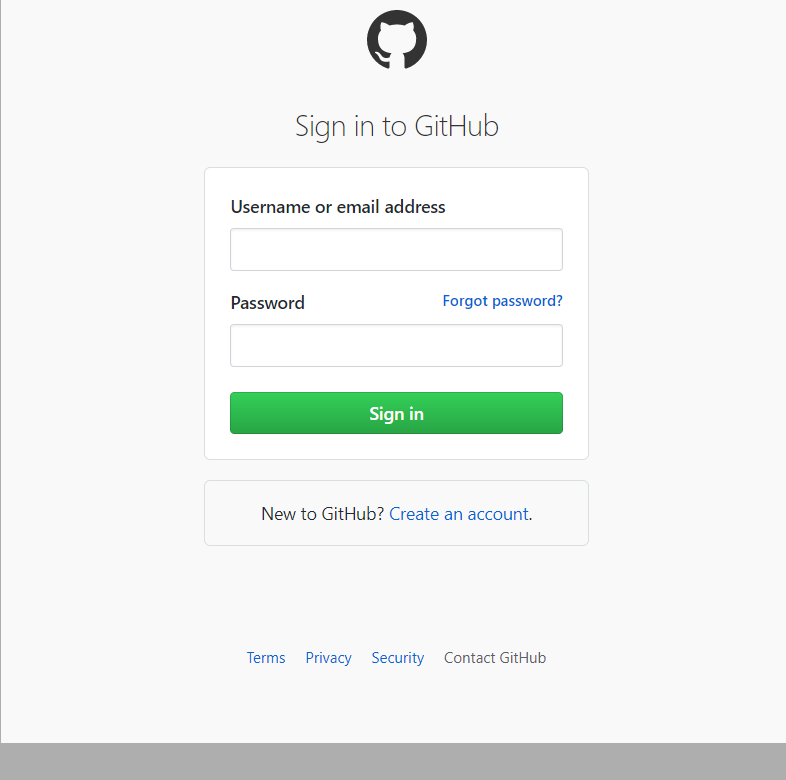

<center>গিট টিটোরিয়ার</center>

আজকের জন্য থাকছে অত্যন্ত গুরুত্বপূর্ণ  টপিক নিয়ে আলোচনা। আমারা যারা প্রোগ্রামিং করি তাদের জন্য গিট হচ্ছে একটি এমন মাধ্যম যার মাধ্যমে কজের ১০০% সিকিউরিটি থাকে। রিমোটলি প্রজেক্ট ম্যানেজ করা যায় । সবকিছু মিলাই গিট হচ্ছে প্রোগামারদের লাইফ সেবিংস মেডিসিন। তাই আর আজে বাজে না বকে শুরু করে দেই গিট নিয়ে আলোচনা । তো প্রথমেই এই লিঙ্কে গিয়ে একাউন্ট খুলে নেই <a href="https://github.com/">Click</a>


লিঙ্কে গেলেই আপনি টিক এইরকমের একটি পেইজ পাবেন আর এইখানে আপানার নাম ই-মেইল আর পাসয়ার্ড দিয়ে খুলে নিন গিটহাব একাউন্ট। 

গিট হাব একাউন্ট খুলা হয়ে গেলে এবার আপনি mail ভেরফিকেশন করে নিন মেইল ভেরিফিকেশন হয়ে গেলে এবার  সাইন ইন করুন 



এবার আপনার ই-মেইল আর পাসওয়ার্ড দিয়ে গটাগট সাইন ইন করে নিন। আর যদি আপনি সঠিক ভাবে করতে পারেন তাইলে আপনি হয়ত  টিক এইরকম একটা স্ক্রিন পাবেন । 


এর পর একটি রপ্রেজটরি খুলে নিন 


New repository তে ক্লিক করে প্রয়োজনীয় ইনফরমেশন দিয়ে খুলে নিন একটি নতুন রিপ্রজেটরি 

ব্যস আপানার গিট রিপ্রেজেটরি তৈরী হয়ে গেল।

এবার আপনার কাজ হলো আপনার পিসিতে একটি মহান সফটওয়্যার ডাইনলোড করে নেওয়া যাতে করে আপনার পিসি গিটের সাথে একটু সম্পর্ক স্থাপন করতে পারে। <a href="https://gitforwindows.org/">Click</a> ডাউলোড হয়ে গেলে এবার ইন্সটল করে নিন টুকুর টুকুর করে ক্লিক করে । ইন্সটল হয়ে গেলে আপানার যেকোন একটি ডাইরেক্টরিতে গিয়ে রাইট ক্লিক করে নিন । রাইট ক্লিক করলে দেখবেন আপনার পিসিতে ==git bash here==  নামে একটি লেখা এসেছে সেটা মনে প্রশ্ন না করে গপাগপ ক্লিক করে নিন তারপঅর দেখবেন সাউথ আফ্রিকার মত কালো একটা টারমিনাল ওপেন হয়ে গেছে ।


command গুলো লিখেন 


```cmd
mkdir Test(your folder Name)

git init

touch Test.txt (your file name with extension);

git status 

git add .

git commit -m "your comment write here"

```

এর পরে আপনার অনলাইনে খোলা রিপ্রেজেটরিতে যান আর গিয়ে সেখানে 


llink টা কপি করে আপনার git bash এ পেস্ট করুন । আর এন্টার চাপুন এর পর   

```
git push -u origin master
```

command টি লিখে রান করুন।

ব্যস আপনার প্রজেক্ট টি github এ  upload হয়ে যাবে ।এবার আপনি আপনার পেইজ টি রিফ্রেশ করুন দেখবেন প্রেজেক্ট আপলোড হয়ে গেছে ।


এবার যদি আপনি কোন ভাবে আপনার প্রজেক্ট টি আপনার কাজের জন্য কোন জায়গায় ডাউনলোড করতে চান তাইলে 

```
git clone (project url)
```

এই কমান্ড টা রান করাইলেই হলো । প্রজেক্ট নেমে যাবে আপনার পিসিতে । তারপর কাজ শেষে আগের মতো 

```
git push -u origin master
```

command টা লিখলেই হলো । 

তারপর আপনার যদি পিসিতে প্রজেক্ট আগে থেকে থাকে অন্য পিসিতে যদি কাজ করে আপ করে থাকেন তাইলে গিত পুল করে নিতে হবে এতে করে নতুন কাজ গুলো আপনার পিসিতে সংযোগ হয়ে যাবে ।

```
git pull
```


author 

Nipu Chakraborty

pro.nipu@gmail.com